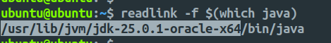

# OpenSSL JOSTLE Deployment Guide

OpenSSL JOSTLE is a Java provider that wraps OpenSSL native library features into a standard Java JCA/JCE Provider. This guide covers the deployment process on a Linux system.

## Prerequisites

The deployment requires Java 25 to build, though the final jar supports Java 1.8 to Java 25. You will also need CMake version 3.31 or higher.

## Deployment Steps

### 1. System Preparation

Update system packages and install build dependencies:

```bash
sudo apt update && sudo apt upgrade
sudo apt install -y build-essential checkinstall zlib1g-dev libssl-dev
sudo apt install -y perl-modules perl-doc
```

### 2. Build OpenSSL Library 3.5

Download and extract OpenSSL source:

```bash
wget https://github.com/openssl/openssl/releases/download/openssl-3.5.4/openssl-3.5.4.tar.gz
tar -xzf openssl-3.5.4.tar.gz
cd openssl-3.5.4/
```

Configure and build OpenSSL with a local prefix:

```bash
## installing it to a local directory, openssl_3_5 instead of system-wide installation
./Configure --prefix=`pwd`/../openssl_3_5
make clean
make -j$(nproc)
make install_sw
```

Set the OPENSSL_PREFIX environment variable:

```bash
cd ../openssl_3_5/
export OPENSSL_PREFIX=`pwd`
echo "${OPENSSL_PREFIX}"
cd ..
```

### 3. Install Java 25

Download and install Java Development Kit 25 (any provider will work, Oracle JDK is used here):

```bash
wget https://download.oracle.com/java/25/latest/jdk-25_linux-x64_bin.deb
sudo dpkg -i jdk-25_linux-x64_bin.deb
java --version
```

Configure Java environment variables:

```bash
readlink -f $(which java)
```



```bash
export JAVA_HOME=/usr/lib/jvm/jdk-25.0.1-oracle-x64
export PATH=$JAVA_HOME/bin:$PATH
```

### 4. Install CMake

Download and install CMake 4.1.2 (any version >= 3.31 will work):

```bash
wget https://github.com/Kitware/CMake/releases/download/v4.1.2/cmake-4.1.2-linux-x86_64.tar.gz
tar -xzf cmake-4.1.2-linux-x86_64.tar.gz
sudo cp -r cmake-4.1.2-linux-x86_64 /opt/cmake
sudo ln -s /opt/cmake/bin/cmake /usr/local/bin/cmake
cmake --version
```

### 5. Build OpenSSL JOSTLE

Clone the repository:

```bash
git clone https://github.com/openssl-projects/openssl-jostle.git
cd openssl-jostle/
```

Generate Java headers:

```bash
./gradlew clean compileJava
```

Enable operations testing support (optional):

```bash
export JOSTLE_OPS_TEST=true

# To unset
unset JOSTLE_OPS_TEST
```

Build the interface libraries:

```bash
./interface/build.sh
```

The command will compile the C/C++ interface layer that bridges Java and OpenSSL. This script uses `CMAKE` and the previously set `OPENSSL_PREFIX` to find OpenSSL libraries. It generates both JNI (Java Native Interface) and FFI (Foreign Function Interface) bindings. The compiled libraries are automatically copied to `jostle/src/main/resources/native/`.

Build the final jar:

```bash
./gradlew clean build

## To skip tests during build
./gradlew clean build -x test
```

### 6. Verify Installation

Run the DumpInfo utility to verify successful deployment:

```bash
java --module-path jostle/build/libs/openssl-jostle-1.0-SNAPSHOT.jar \
--enable-native-access=org.openssl.jostle.prov \
--module org.openssl.jostle.prov/org.openssl.jostle.util.DumpInfo
```

## Build Output

The compiled jar file will be located at:

```
jostle/build/libs/openssl-jostle-1.0-SNAPSHOT.jar
```

## Interface Selection

JOSTLE defaults to FFI interface when available. To force JNI interface:

```bash
java -Dorg.openssl.jostle.loader.interface=JNI \
--module-path jostle/build/libs/openssl-jostle-1.0-SNAPSHOT.jar \
--enable-native-access=org.openssl.jostle.prov \
--module org.openssl.jostle.prov/org.openssl.jostle.util.DumpInfo
```

Interface Options:

- `auto`: Automatically detect and use FFI if available, otherwise JNI
- `ffi`: Force FFI interface only
- `jni`: Force JNI interface only
- `none`: Do not extract interface libraries (for custom configurations)
